we have successfully finished binary search and its advanced application. let us now move on to study number theory which is the most important part of CP
## Number_Theory
### EP 47 (binary number and bits basics)

AND (&), OR (|), XOR (^) 
- XOR returns 0 when both are same else 1
- XOR can be use very creatively in alot of problems
left/right shift
- 3 << 2 => 11 -> 1100 (=12)
- 1 << n => 2^n
### EP 48 (playing with bits)
- indexing in binary nos start from right (and 0,1,2... obv)
- right most digit in binary nos is least sig and left most is most sig
- set bit =1 , unset = 0
- to check if nth bit is set or not, take a number with that index bit = 1 and rest 0, then do and of both nos, if u get 0 its not set else its set
- 2^n - 1 form is n 1s in binary
- code for checking if ith bit is set for int a :
```cpp
cout << (a & (1>> i) == 0);
```
- setting ith bit
```cpp
a = a | (1<<i);
```
- unsetting ith bit
```cpp
a = a & (~(1<<i));
```
- toggling ith bit
```cpp
 a = a ^ (1<< i);
```
- printing the binary
```cpp
void printBinary(int n){
	for (int i = 31; i >= 0; --i)
	{
		cout << ((n >> i) & 1);
		//above line checks whether ith bit is 1 or 0
	}
	cout << endl;
	
}
```
- there exists a func in stl for checking set count named __builtin_popcount() or __builtin_popcountll()

### EP 49 (amazing bit tricks)
- checking whether a no is even or odd
```cpp
cout << (n &1 == 0); //returns true for even 
```
- multiply & div by 2^i
```cpp
cout << (n<<i); //mult by 2^i
cout << (n >> i); //div by 2^i

```
- converting upper case/ lower  case using bit toggle. main idea is 5th bit in capital and smaller are the only difference in them so we can toggle to get one another.
```cpp
 string input;
 cin >> input;

 for (int i = 0; i < input.size(); ++i)
 {
 	input[i] = input[i] ^ (1<< 5);
 }
 cout << input;
```
- removing some i least significant digits
```cpp
// i+1 bcz indexing starts from 0
cout << a & (~((1 << i+1) - 1));
```
- removing some  most significant digits on left of ith bit
```cpp
cout << a & ((1<< i+1) - 1);
``` 
- checking if a no. is power of 2
```cpp
if (n & n-1 == 0){
    // power of 2
}
else{
    // no
}
```
### ep 50 (prop of XOR operator)
- x^x = 0, x^0 = x
- order of xor do not matter ie x ^ y ^ z = x ^ z ^ y
- using above 2 we can swap two numbers like below
```cpp
int a = 10, b = 4;
a = a^ b;
b = b ^ a; // now b becomes a
a = a^b // now a becomes b
```
**odd count que**
```cpp
// among n nos we have only one of them ahve oddd count so we take xor of all of them which cancels all even counts.
for (int i = 0; i < n; i++){
    ans = ans ^ array[i];
}
```
### ep 51 (bitmasking)
it is the ability to represent a real world problem as a binary number. (this number is bitmask)
- ex : say u have smth like 2,3 -> 1100 0,1,2 -> 0111 and 1,3 -> 1010. now after representation we can solve variety of problems like taking intersection of n stuff in O(1) like intersec in of 2,3 and 0,1,2 is just and of both which is 0100

now we do a ques from cf blog where we have to max intersection of common days between workers
```cpp
int n;
vector<int> masks(n,0);
cin >> n;
for (int i = 0; i < n; i++){
	int days;
	cin >> days;
	for (int j = 0; j < days; j++){
		int d;
		cin >> d;
		masks[i] = masks[i] | (1 << d);
	}
}

for (int i = 0; i < n; i++){
	for (int j = i+1; j < n; j++){
		// now intersection can be taken in O(1) instead of O(30)
		int intersection = __builtin_popcount((masks[i] & masks[j])); // gives no of set bits
		// now just use a max func to get max
	}
}
```

### ep 52 generating subsets using bitmasking
we did bitmasking last class, its the same concept. jth bit set implies jth index of array is taken.

note time complexity of below code is o(n * (2 ^n))
```cpp
//leetcode subsets
vector<vector<int>> subsets(vector<int>& nums) {
        int n = nums.size();
        int subset_cnt = (1 << n);
        vector<vector<int>> subsets;

        for (int i = 0; i < subset_cnt; i++) {
            vector<int> subset;
            // check which bits are set
            for (int j = 0; j < n; j++) {

                if ((i & (1 << j)) != 0) { // if jth bit is set take that
                                           // element
                    subset.push_back(nums[j]);
                }
            }
            subsets.push_back(subset);
        }
        return subsets;
    }
```
### ep 53 gcd and lcm with euclids algorithm
basics of lcm and gcd. (already know)

implementing gcd using euclids algorithm
```cpp
// below func has roughly log(N) time complexity as we take max divisions which is just log 
int gcd(int a, int b){ // a is dividend, b is divisor so a > b in general
	if (b == 0){
		return a; // obv gcd of b and 0 is b
	}
	return gcd(b, a%b);
}
```
above is based on fact that gcd(a,b) is gcd(b, a%b).

__gcd() is built in func in stl.

gcd of multiple numbers can be computed by taking gcd of smaller part of them then taking gcd with remaining numbers
- ex: gcd(a,b,c) = gcd(a,gcd(b,c)) 


### ep 54 binary exponentiation

the reason we study this is bcz the built in pow function has alot of precision errors since it returns a double. so we need our own funcs.

below is recursive code for bin exp.
```cpp
const int M = 1e9 + 7;
int binexprec(int a, int b){
	if (b == 0) return 1;
	int res = binexprec(a,b/2);
	if (b&1){
		return (a * ((1LL *res * res)%M)) % M;
	}
	else{
		return (1LL *res * res) % M;
	}
}
```

now we look at iterative bin exp which is faster and better than above.

main idea is to write binary of the power b then do below
- ex : 3^5 = 3^(101) = 3^(2^2 + 2^0) = 3^4 * 3^1
```cpp
int binexpiter(int a, int b){
	int ans = 1;
	while(b){
	if (b&1){ //ie current (last) bit is set
		//in this case we consider the power of a
		ans = (1LL*ans * (a))%M; // a is current power of a
	}
	//after this increase a power by square
	a = (1LL*a * a) % M;

	//get the next bit to current
	b = b >> 1;
	}
}
```

### ep 55 large exponentiation

in this lec, we analyse cases for when either a is large or b is large etc.

the code we wrote above assumed that both a and b are in integer range and M is of 1e9 order.

1. let us first see case of a <= 10^18. this case is very trivial as u can see we can directly take mod of a by mod arithematic rules. 
- a^b % M = ((a% M)^b)%M

```cpp
// same func as above just use like below
binexpiter(a%M, b);
```
2. now lt us observe case of M <=10^18. now we cannot do the 1LL * stuff as even this could overflow (bcz M range is high so is the output) here for multiplying any two numbers a*b we have to write a function assuming both a and b are <= 10^18. since max value of a + b is 2 * 10^18 and max we can store in long long is > 2 * 10^18. so we can use a custom multiplication function which converts multiplication to addition then it takes mod every 2 terms hence final value remains <= 10^18. but this would make the mult O(N) we need faster like O(logN) so we use binary multiplication.
```cpp
long long binmult(long long a, long long b){
	long long ans = 0;
	while(b){
	if (b&1){ //ie current (last) bit is set
		//in this case we consider the power of a
		ans = (ans + a)%M; // a is current power of a
	}
	//after this increase a power by square
	a = (a + a) % M;

	//get the next bit to current
	b = b >> 1;
	}
}
```
- this function will allow us to compute a * b % M when both a, b are in range of 10^18. now we put this in our exp code
```cpp
long long binexpiter(long long a, long long b){
	long long ans = 1;
	while(b){
	if (b&1){ //ie current (last) bit is set
		//in this case we consider the power of a
		ans = binmult(ans,a); // a is current power of a
	}
	//after this increase a power by square
	a = binmult(a,a);

	//get the next bit to current
	b = b >> 1;
	}
}
```
### ep 56 large exponentiation with large b
here if b <= 10^18 then we can simply replace int b with long long b in our own function no big deal. let us study what happens when b exceeds 1e18.

in such cases we would use euler theorm which states state that a^b % M is just (a ^ (b % phi(M)))% M.
**note that it is only valid when gcd(a,M) =1**.

- for prime M, we can write a^b % M as (a^ (b % M-1))%M

```cpp
int binexpiter(int a, int b, int m){
	int ans = 1;
	while(b){
	if (b&1){ //ie current (last) bit is set
		//in this case we consider the power of a
		ans = (1LL*ans * (a))%m; // a is current power of a
	}
	//after this increase a power by square
	a = (1LL*a * a) % m;

	//get the next bit to current
	b = b >> 1;
	}
}

// now to compute a^ (b^c), assume phi(m) is etf
binexpiter(a, binexpiter(b,c,phi(m)), m);
```

### ep 57 (factors and divisors)

first we have brute force approach. which is just run a for loop and find count, sum of div. this is O(N).

then we have a better approach pf O(n^0.5) which leverages the fact that n1 * n2 will always have one of them less than =(n)^0.5 and other more =.

```cpp
for(int i = 1; i*i <= n; i++){
	if (n%i == 0){
		if (i*i != n){
			int div1 = i;
			int div2 = n/i;
			// sum  += div1 + div2;
			//cnt += 2;
		}
		else{
			int div = i;
			//cnt++;
			sum += div;
		}
	}
}
```

then we study the formulas for prod and sum of div which we did in jee.using these formulas we can find sum and count even faster than O(N^0.5) given we have a optimised algorithm to find prime factorisation (which we do).

### ep 58 prime check and prime factorisation

condition of a prime no is it must have only 2 divisors, so we can write a brute force O(root N) using above which checks for prime.

smallest divisor(> 1) of a number exceeding 1 is always a prime. we can use this fact to compute prime factorisation


below is O(N) implementation of it.
```cpp
vector<int> prime_fact;
for (int i = 2; i <= n; i++){
	if (n %i == 0){ //this is the smallest divisor and hence prime
		while (n %i == 0){
			prime_fact.push_back(i);
			n /= i;
		}
	}
}
```

we can optimise this approach by using the fact that if we run till root N, it will still cover all primes except for maybe 1 which can be handled separately.
(dont know how this works tbh will see it later)
```cpp
vector<int> prime_fact;
for (int i = 2; i*i <= n; i++){
	if (n %i == 0){ //this is the smallest divisor and hence prime
		while (n %i == 0){
			prime_fact.push_back(i);
			n /= i;
		}
	}
}
if (n > 1){
 // one prime left
	prime_fact.push_back(n);
}
```

### ep 59 sieve algorithm

it is an algorithm that computes prime by writing all numbers from 2 to n then assumes all of them are prime. then for each prime number it goes to its multiple and unmark it as prime. this happens till n is reached. 
```cpp
const int n = 1e7 + 10;
vector<bool> isPrime(n,1); //all tru by default

int main(){
	isPrime[0] = isPrime[1] = false; //0 and 1 r not prime
	for (int i = 2; i < n; i++){
		if (isPrime[i] == true){
			for (int j = 2*i; j < n; j+= i){
				isPrime[j] = false;
			}
		}
	}
}

```

time complexity of above code is N log log N proof can be found in cses handbook.

### ep 60 sieve variation for number theory problems

first variation which we consider is computing lowest and highest prime of a number .
```cpp
const int n = 1e7 + 10;
vector<bool> isPrime(n,1); //all tru by default
vector<bool> lp(n, 0);
vector<bool> hp(n, 0);
int main(){
	isPrime[0] = isPrime[1] = false; //0 and 1 r not prime
	for (int i = 2; i < n; i++){
		if (isPrime[i] == true){
			lp[i] = hp[i] = i;
			for (int j = 2*i; j < n; j+= i){
				isPrime[j] = false;
				hp[j] = i;
				if (lp[j] == 0){
					lp[j] = i;
				}
			}
		}
	}
}

```

now using above variation we can  compute prime factorisation of any number in logN which is quite fast.
```cpp
const int n = 1e7 + 10;
vector<bool> isPrime(n,1); //all tru by default
vector<bool> lp(n, 0);
vector<bool> hp(n, 0);
int main(){
	isPrime[0] = isPrime[1] = false; //0 and 1 r not prime
	for (int i = 2; i < n; i++){
		if (isPrime[i] == true){
			lp[i] = hp[i] = i;
			for (int j = 2*i; j < n; j+= i){
				isPrime[j] = false;
				hp[j] = i;
				if (lp[j] == 0){
					lp[j] = i;
				}
			}
		}
	}

	// we can use either lp or hp for this purpose.
	int num;
	cin >> num;
	vector<int> pfs;
	while(num > 1){
		int pf = hp[num];
		while(num % pf == 0){
			pfs.push_back(pf);
			num /= pf;
		}
	}
}

```

we can also use sieve to compute all divisors of a num. time complexity of this code is O(NlogN)
```cpp
vector<int> divisors[n]; // stores divisors of number from 1 to n
for (int i = 1; i < n; i++){
	for (int j = i; j < n; j+= i){
		divisors[j].push_back(i);
	}
}
```
u can also store sum in above by doing ``` sum[j] +=i ``` and so on we can have infinite ideas.

### ep 61 modular inverse

``` (a/b) % M = (a * inv(b)) % M = ((a % M) * (inv(b) % M))%M ``` where inv(b) % M is called modular inverse of a wrt M which is defined as when ```(a * b ) % M = 1```. note this is only defined when a and M are coprime.

we can find this inverse by running a for loop of values of b from 0 to M-1, and select the one which follows all above conditions. obv this would work only when M is not large.

if M is large there is an optimised approach given by fermats little theorm which says
``` inv of a wrt M is (a^(M-2) % M) ``` assuming M is prime and **a is not a multiple of M**. notice how this computes inverse in logM (by binary exp) which is very good.

**Ques: compute nCk mod M both n,k ~ 1e6, M = 1e9 + 7, queries ~1e5**

```cpp
const int M = 1e9 + 7;
const int N = 1e6 + 10;
int fact[N]; // we precompute the factorials because of queries

int main(){
	fac[0] =1;
	for(int i =1; i < N; i++){
		fact[i] = (fact[i-1]*1LL*i) % M;
	}
	int q;
	cin >> q;
	while(q--){
		int n, k;
		cin >> n >> k;

		int denominator = fact[n-k] * 1LL * fact[k];
		int ans = fact[n] * (binexpiter(denominator, M-2, M));
		cout << ans << endl;
	}
}
```

### ep 62 hackerearth unlock the door question
had already done. basically exactly same as above question just more terms.

### ep 63 sieve fundamental question
hacker earth monk and divisor conundrum
```cpp
#include<bits/stdc++.h>
using namespace std;

const int N = 2e5+10;
int mult_cts[N]; //array that tells that ith index has array[i] elements in given array that are divisible by i
int hsh[N];

int main(){
 ios_base::sync_with_stdio(0);
 cin.tie(0);cout.tie(0);
 int n;
 cin >> n;

 for (int i = 0; i < n; ++i)
 {
 	int x;
 	cin >> x;
 	hsh[x]++;
 }

 for (int i = 1; i < N; ++i)
 {
 	for (int j = i; j < N; j+=i)
 	{
 		mult_cts[i] += hsh[j]; // precomputes the array
 	
 	}
 }
 int t;
 cin >> t;
 while(t--){
 	int p, q;
 	cin >> p >> q;
 	int ans = mult_cts[p] + mult_cts[q];
 	long long lcm = (p * 1LL * q )/__gcd(p,q);
 	if (lcm < N){
 		ans -= mult_cts[lcm];
 	}
 	cout << ans << endl;

 }


 return 0;
}
  
```

### ep 64 good question involving multiple number theory concepts (including sieve)

hacker earth : hacker decrypting messages

***THIS CURRENTLY CONTAIN BUGS THAT NEED FIXING***

```cpp
#include<bits/stdc++.h>
using namespace std;

const int N = 2e6 + 10;
int a[N];
int hp[N];
int can_remove[N];
vector<int> pfzn(int x){
	vector<int> ans;
	while (x > 1){
		int pf_ = hp[x];
		while(x % pf_ == 0){
			x = x/pf_;
		}
		ans.push_back(pf_);
	}
	return ans;
}
signed main(){
 ios_base::sync_with_stdio(0);
 cin.tie(0);cout.tie(0);
 for (int i = 2; i < N; ++i)
 {
 	if (hp[i] == 0){

 		for (int j = i; j < N; j+=i)
 		{
 			hp[j] = i;
 		}
 	}
 }
 int n, q;
 cin >> n >> q;
 for (int i = 0; i < n; ++i)
 {
 	int no;
 	cin >> no;
 	for (long long j = no; j < N; j *= no)
 	{
 		if (j < N){
 			can_remove[j] = 1;
 		}
 		
 	}
 }
 while(q--){
 	int x;
 	cin >> x;

 	// we need to find prime factorisation of x, so let us create a hp array and use sieve
 	vector<int> pf = pfzn(x);
 	bool isPossible = false;
 	// now we need to run a n^2 for loop for iterating through our pfzn
 	for (int i = 0; i < pf.size(); ++i)
 	{
 		for (int j = i; j < pf.size(); ++j)
 		{
 			int product = pf[i] * pf[j];
 			// checking case of same prime factor
 			if (i == j && (x % product != 0)){
 				continue; //not possible
 			}
 			int to_remove = x/product;
 			if (can_remove[to_remove] == 1 || to_remove == 1){
 				isPossible = true;
 				break;
 			}
 			
 		}
 		if (isPossible == true){
 			break;
 		}
 	}
 	cout << (isPossible ? "YES" : "NO") << endl;
 }

 return 0;
}
  
```

### EP 65 Bit manipulation questions

Q1) hacker earth : Monk and his father

notice if u assume he goes to god for n days and in day i he recives xi from god his total after n days is `2^n * x_1 + 2^n-1 * x_2 +.. 2 * x_n w` which is binary expansion of (x1x2..xn0) notice minimum dollars we ask for is number of set bits in this. so just output the number of set bits in P.

```cpp
#include<bits/stdc++.h>
using namespace std;

signed main(){
 ios_base::sync_with_stdio(0);
 cin.tie(0);cout.tie(0);
 int t;
 cin >> t;
 while(t--){
 	long long x;
 	cin >> x;
 	cout << __builtin_popcountll(x) << '\n';
 }
 return 0;
}
  
```
Q2) hacker earth : XOR challenge
(good question on bitmasking)

```cpp
#include<bits/stdc++.h>
using namespace std;

signed main(){
 ios_base::sync_with_stdio(0);
 cin.tie(0);cout.tie(0);
 int c;
 cin >> c;
 int a = 0, b = 0;
 int n_bits = (int)(log2(c) + 1);
 vector<int> set_bits;
 for (int i = 0; i < n_bits; ++i)
 {
 	if ((c & (1<<i)) == 0){ // ith bit is not set
 		a = a | (1 << i);
 		b = b | (1 << i);
 	}
 	else{
 		set_bits.push_back(i);
 	}
 }
 int sz = 1 << set_bits.size();
 long long ans = -1;
 for (int mask = 0; mask < sz; ++mask)
 {
 	int a_cp = a;
 	int b_cp = b;
 	for (int j = 0; j < set_bits.size(); ++j)
 	{
 		if ((mask & (1 << j)) != 0){
 			a_cp |= (1 << set_bits[j]);
 		}
 		else{
 			b_cp |= (1 << set_bits[j]);
 		}
 	}
 	ans = max(ans, a_cp *1LL * b_cp);

 }
 cout << ans << endl;
 
 return 0;
}
  
```

### EP 66 inclusion exclusion

hacker earth : 3 musketeers

***THERES A SMALL BUG IN THIS NEED FIXING***
```cpp

#include<bits/stdc++.h>
using namespace std;

bool isVowel(char c){
	return c=='a' || c == 'e' || c == 'i' || c == 'o' || c=='u';
}

vector<string> subsets(string s){
	vector<string> ans;
	for (int mask = 0; mask < (1 << s.size()); ++mask)
 		{
 			string s = "";
 			for (int j = 0; j < s.size(); ++j)
 			{
 				if (mask & (1 << j)){
 					s.push_back(s[j]);
 				}
 			}
 			if (s.size()) ans.push_back(s);
 			
 		}
 	return ans;
}
signed main(){
 ios_base::sync_with_stdio(0);
 cin.tie(0);cout.tie(0);
 int t;
 cin >> t;
 while(t--){
 	int n;
 	cin >> n;
 	string comb[n];
 	for (int i = 0; i < n; ++i)
 	{
 		cin >> comb[i];
 	}
 	unordered_map<string, int> hsh;
 	for (int i = 0; i < n; ++i)
 	{
 		set<char> vowels;
 		for (char c : comb[i]){
 			if (isVowel(c)){
 				vowels.insert(c);
 			}
 		}
 		string svowels;
 		for (char c : vowels){
 			svowels.push_back(c);
 		}
 		// now we need to generate all subsets of this string and inc their count. (as aio means a,i,o.. all there)

 		vector<string> all_subsets = subsets(svowels);
 		for(string s : all_subsets){
 			hsh[s]++;
 		}
 	}
 	long long ans = 0;
 	for (auto &pair : hsh){
 		if (pair.second < 3){
 			continue;
 		}
 		
 		long long ct = pair.second;
 		long long ways = ct * (ct -1 ) * (ct - 2) / 6;
 		if (pair.first.size() & 1){
 			ans += ways;
 		}
 		else{
 			ans -= ways;
 		}	
 		
 		
 	}
 	cout << ans << endl;
 }
 return 0;
}
  
```

### EP 68 explaining graph/tree terminologies

graph is just collection of edges and vertices.

directed and non directed edges.

trees are graphs where there are no cycles.

trees always have n-1 edges with n nodes. (any more edges will lead to cycles). (for undirected graphs)

connected components.(for undirected graphs) below figure contains 2 connected components
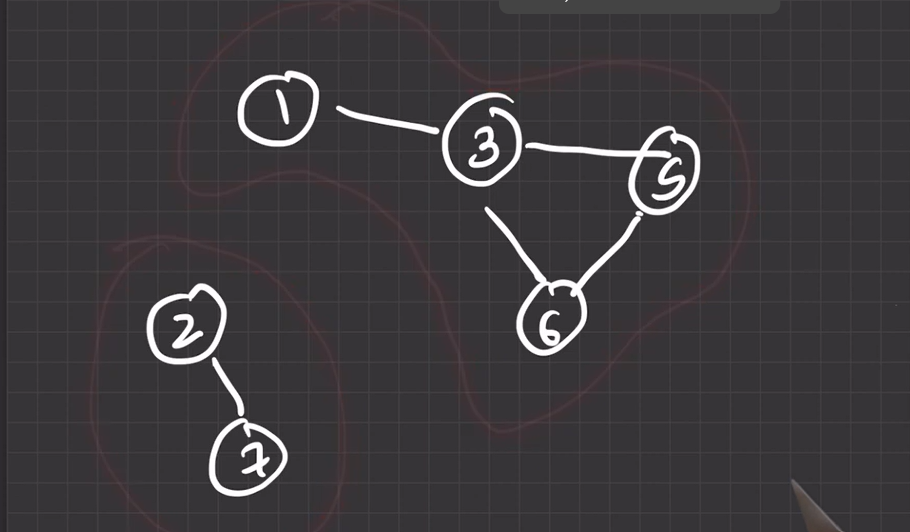

directed cyclic and acyclic graphs. below is example of acyclic directed graph

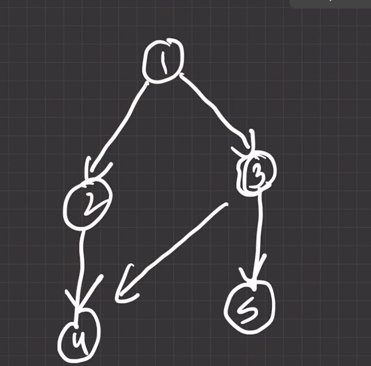

strongly connected components (SCC) in dircted graphs. see below example with 6 scc

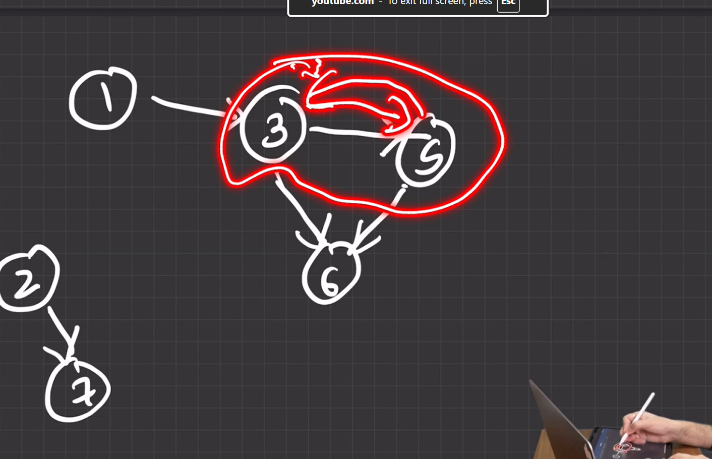

below figure contains 4 scc
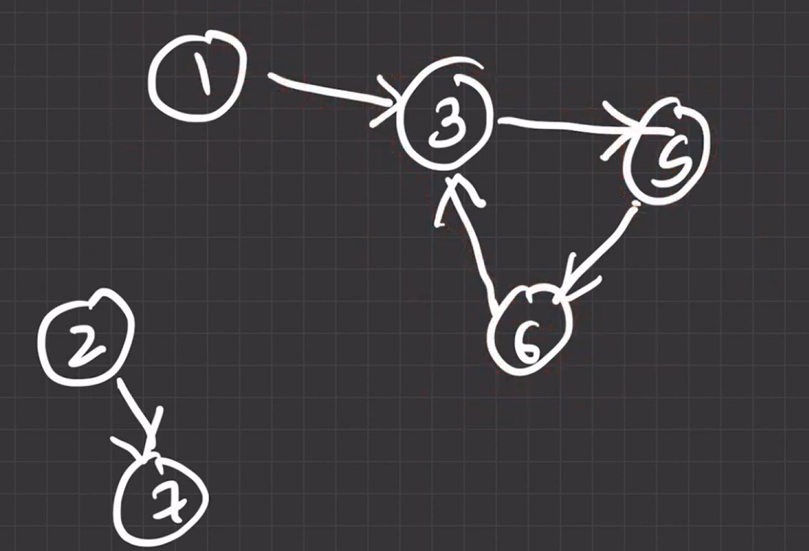

a forest is a collection of 1 or more disjoint trees.

a leaf node in trees is one with no children.

root node is where all children come from.

depth is distance of a node from root node (in terms of edges obv) 
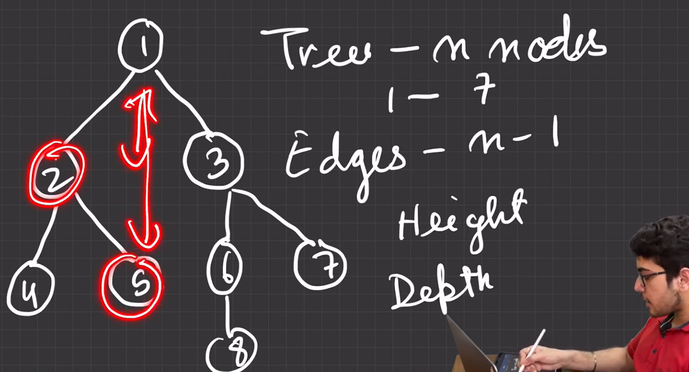

above img has height of node 2 as 1, node 5,6,7 as 2

height of node is its largest distance from leaf node.

LCA (lowest common ancestor) of 8,7 in above figure is node 3. simi node 5,7 have lca as 1.

### EP 69 representing graphs and trees in code

**1 ) adjacency matrix**
make v*v matrix and fill connected vertices as 1. ij means i is connected to j btw
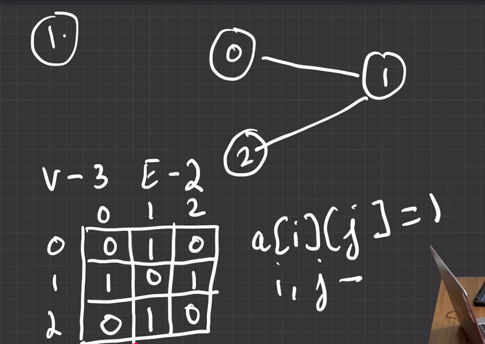

for showing a weighted graph just put weight instead of 1
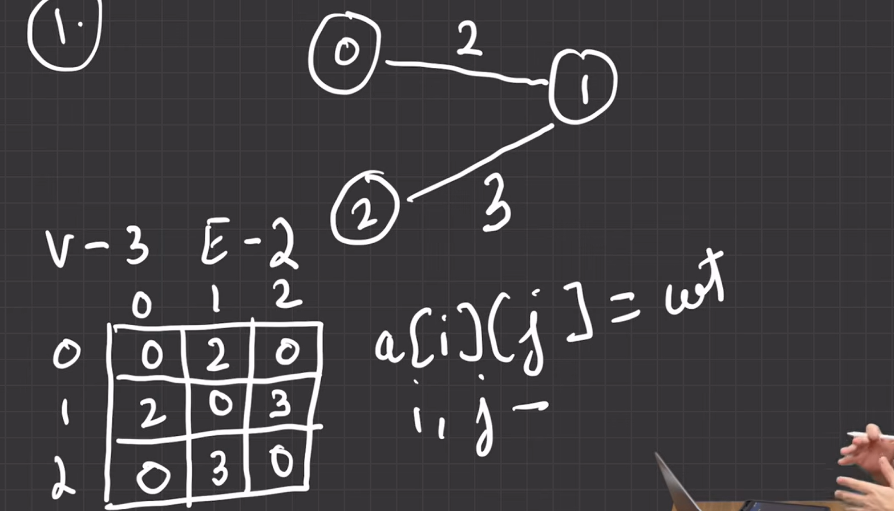

usually inputs in grpahs are given by vertices, edges in one line then all the connections are given in remaining lines.

if weight is also given  along with v1,v2 just use it and store it instead of storing 1.
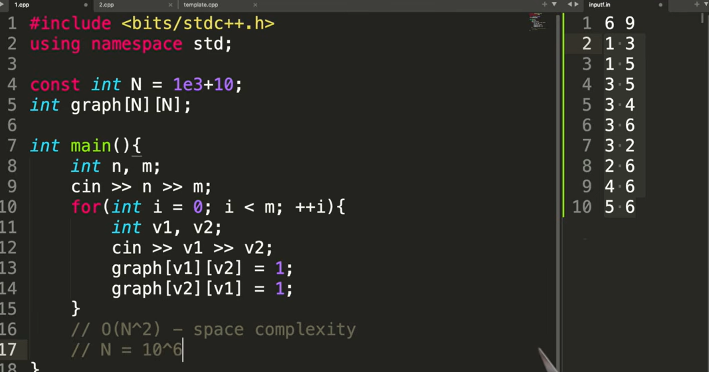
the above graph looks like below

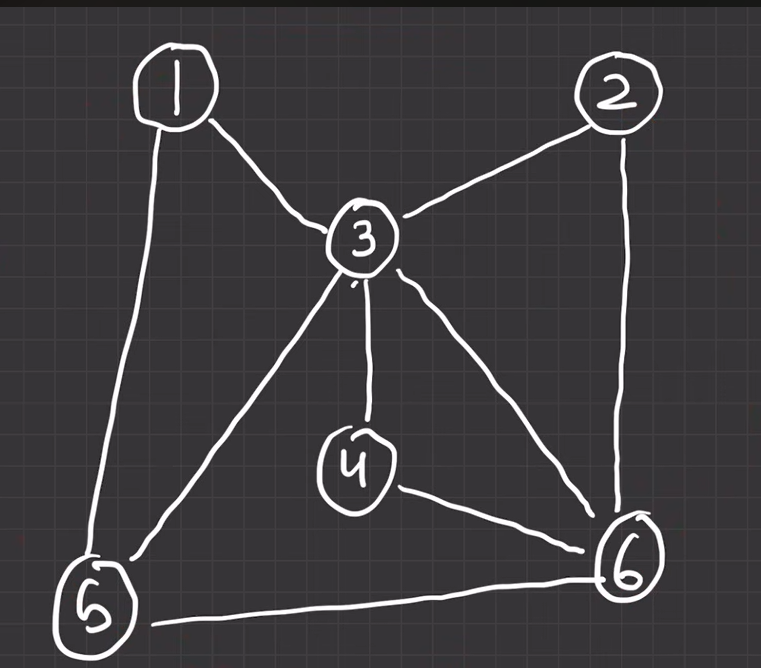

**problems associated**

 with this approach is its massive space complexity.

**benefits of using**

 this is we find weights and connectivity using O(1) compared to finding connectivity using O(n) in list (but wts is O(1) for both)


**2 ) adjacency list**

here for v vertices we create v different lists where list i shows to what nodes is the node i connected to. the space complexity of this is roughly O(V + E)
```cpp
//asuming same input as above code
vector<int> graph[N];
int v, e;
cin >> v >> e;
for (int i = 0; i < e; i++){
	int v1, v2;
	cin >> v1 >> v2;
	graph[v1].push_back(v2);
	graoh[v2].push_back(v1);
	//note above is for undirected otherwise remove line
}
```
now say if we are also given weights then we have to create a vector of pair instead of a int (pair of (v2, weight))

```cpp
vector<int> graph[N];
int v, e;
cin >> v >> e;
for (int i = 0; i < e; i++){
	int v1, v2, w;
	cin >> v1 >> v2 >> w;
	graph[v1].push_back({v2, w});
	graoh[v2].push_back({v1, w});
	//note above is for undirected otherwise remove line
}
```

### ep 70 understanding DFS

the job of DFS is to travel through a graph. it starts from the root node and checks every possible child node, it recursively does this until all children are covered.

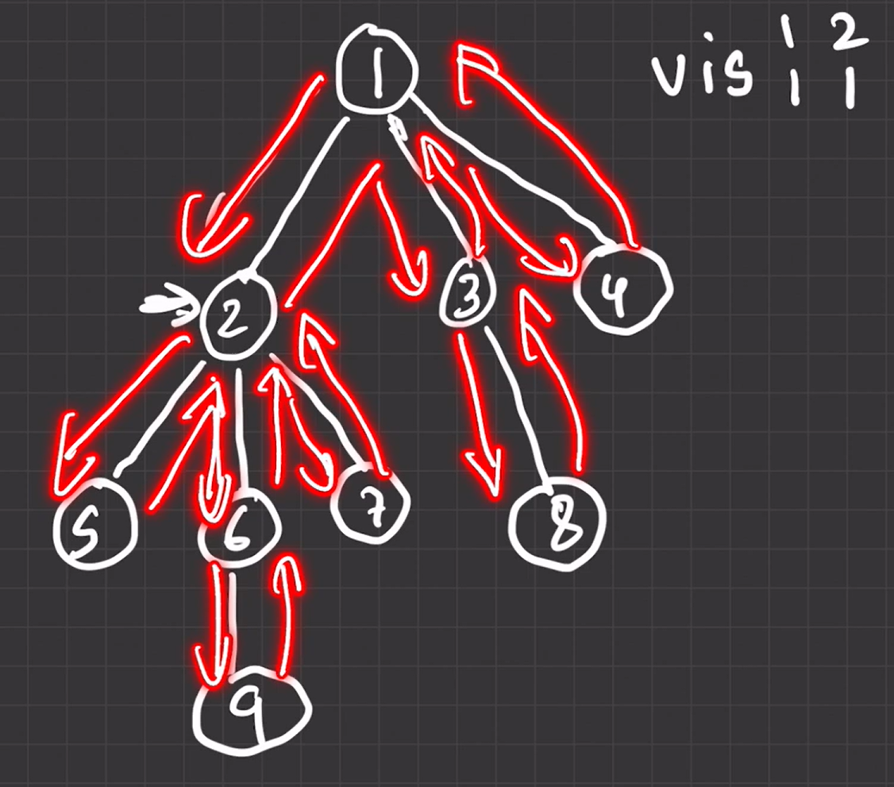

we maintain a visited array to make sure our current node knows which children are unvisited.

**code for dfs:**
```cpp
#include<bits/stdc++.h>
using namespace std;
const int N = 1e5 + 10;
bool vis[N];
vector<int> g[N];

void dfs(int vertex){
	//action on vertex after entering the vertex

	cout << vertex << endl;

	vis[vertex] = true;
	
	for(int child : g[vertex]){
		// action before entering child
		if (vis[child]) continue;

		dfs(child);
		//action after entering child
	}
	//action before exiting the vertex
}

signed main(){
 ios_base::sync_with_stdio(0);
 cin.tie(0);cout.tie(0);
 int n, m;
 cin >> n >> m;
 for (int i = 0; i < m; ++i)
 {
 	int v1, v2;
 	cin >> v1 >> v2;
 	g[v1].push_back(v2);
 	g[v2].push_back(v1);
 }
 dfs(0);
 return 0;
}
  

```

**time complexity of this is O(E + V)**
explanation:
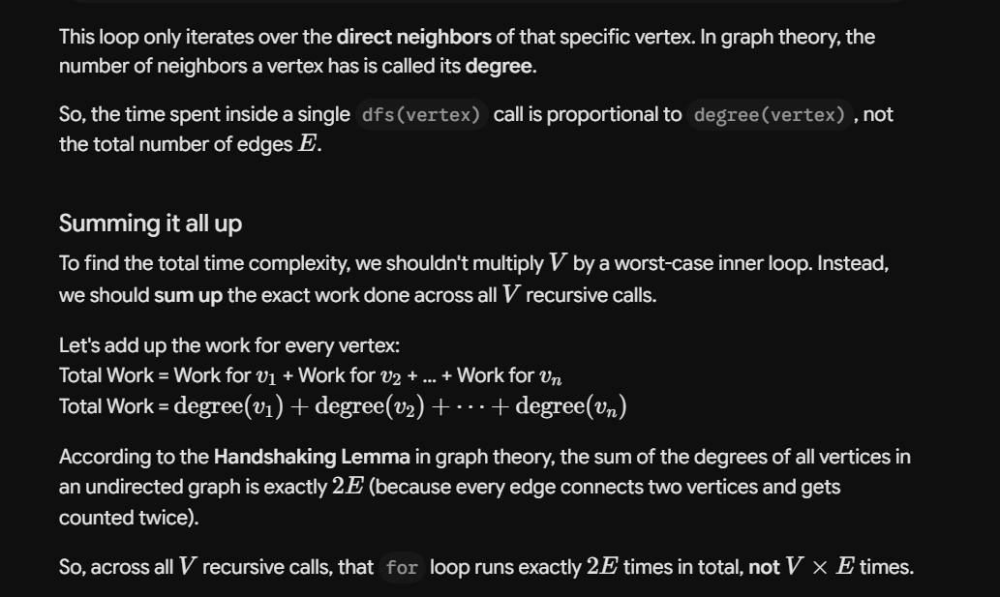

### ep 71 two imp applicaion of DFS

Q1) hacker earth : connected components in a graph

we simply have to compute dfs on all nodes one by one, it will only do it on unvisited nodes. then we simply see the count.

```cpp
#include<bits/stdc++.h>
using namespace std;
const int N = 1e5 + 10;
bool vis[N];
vector<int> g[N];

void dfs(int vertex){
	//action on vertex after entering the vertex
	vis[vertex] = true;
	
	for(int child : g[vertex]){
		// action before entering child
		if (vis[child]) continue;

		dfs(child);
		//action after entering child
	}
	//action before exiting the vertex
}

signed main(){
 ios_base::sync_with_stdio(0);
 cin.tie(0);cout.tie(0);
 int n, m;
 cin >> n >> m;
 for (int i = 0; i < m; ++i)
 {
 	int v1, v2;
 	cin >> v1 >> v2;
 	g[v1].push_back(v2);
 	g[v2].push_back(v1);
 }
 int count = 0;
 for (int i = 1; i <= n; ++i)
 {
 	if (vis[i]) continue;
 	dfs(i);
 	count++;
 }
 cout << count << endl;
 return 0;
}
  
```

let us now figure out how to actually store these connected components


it is trivial tbf, as one dfs will always go through 1 fully connected part, so we use this fact and then just count.

```cpp
#include<bits/stdc++.h>
using namespace std;
const int N = 1e5 + 10;
bool vis[N];
vector<int> g[N];
vector<vector<int>> ccs;
vector<int> curr_cc;

void dfs(int vertex){
	//action on vertex after entering the vertex
	vis[vertex] = true;
	curr_cc.push_back(vertex);


	for(int child : g[vertex]){
		// action before entering child
		if (vis[child]) continue;

		dfs(child);
		//action after entering child
	}
	//action before exiting the vertex
}

signed main(){
 ios_base::sync_with_stdio(0);
 cin.tie(0);cout.tie(0);
 int n, m;
 cin >> n >> m;
 for (int i = 0; i < m; ++i)
 {
 	int v1, v2;
 	cin >> v1 >> v2;
 	g[v1].push_back(v2);
 	g[v2].push_back(v1);
 }
 int count = 0;
 for (int i = 1; i <= n; ++i)
 {
 	if (vis[i]) continue;
 	curr_cc.clear();
 	dfs(i);
 	ccs.push_back(curr_cc);
 	count++;
 }
 for(auto cc : ccs){
 	for (auto elem : cc){
 		cout << elem << " ";
 	}
 	cout << endl;
 }
 return 0;
}
  
```

now we will check how to check whether a graph is cyclic or no, notice that if u apply dfs to a cylic graph it will always come to a node where its one child will be already visited (obv excluding the one we just came from )

```cpp
#include<bits/stdc++.h>
using namespace std;
const int N = 1e5 + 10;
bool vis[N];
vector<int> g[N];

bool dfs(int vertex, int parent){
	//action on vertex after entering the vertex
	vis[vertex] = true;
	bool ans = false;
	for(int child : g[vertex]){
		// action before entering child
		if (vis[child] == true && child == parent) continue;
		if (vis[child]) return true;

		ans |= dfs(child, vertex);
		//action after entering child
	}
	return ans;
	//action before exiting the vertex
}

signed main(){
 ios_base::sync_with_stdio(0);
 cin.tie(0);cout.tie(0);
 int n, m;
 cin >> n >> m;
 for (int i = 0; i < m; ++i)
 {
 	int v1, v2;
 	cin >> v1 >> v2;
 	g[v1].push_back(v2);
 	g[v2].push_back(v1);
 }
 
 bool ans = false;
 for (int i = 1; i < n; i++){
	if (vis[i]) continue;
	if (dfs(i,0)){
		ans = true;
		break;
	}
 }
 cout << ans << endl;
 return 0;
}
```

### ep 72 solving graph matrix problems

leetcode : flood fill

we will convert this interconnected pixels to a graph then perform DFS to convert all of them to 2.

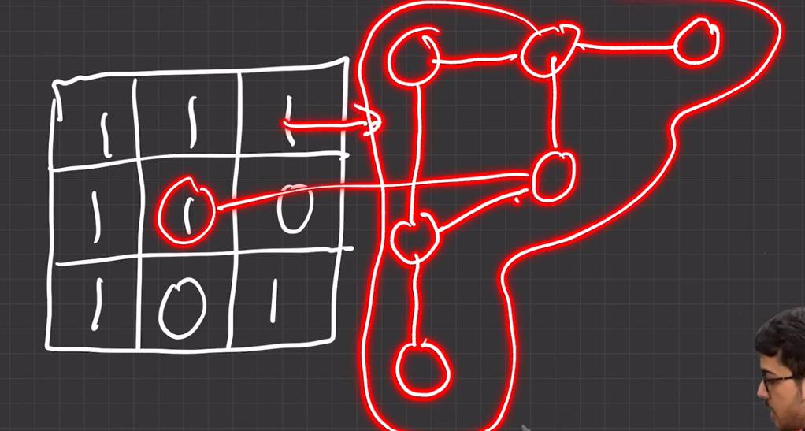

```cpp

class Solution {
public:
    void dfs(int i, int j, int initial_color, int color,
             vector<vector<int>>& image) {
        int n = image.size();
        int m = image[0].size();
        if (i < 0 || j < 0) return;
        if (i >= n || j >= m) return;
        if (image[i][j] != initial_color) return;

        image[i][j] = color;

        dfs(i - 1, j, initial_color, color, image);
        dfs(i, j - 1, initial_color, color, image);
        dfs(i + 1, j, initial_color, color, image);
        dfs(i, j + 1, initial_color, color, image);
    }

    vector<vector<int>> floodFill(vector<vector<int>>& image, int sr, int sc,
                                  int color) {
        int initial_color = image[sr][sc];
        if (initial_color != color)
            dfs(sr, sc, initial_color, color, image);
        return image;
    }
};
```

now we have a homework : leetcode 200, number of islands.

*left to do*

```cpp

```

### ep 73 DFS in a tree

for using dfs in trees, we can remove the visited array for optimising our code. we will instead pass it 2 variables (vertex, parent)

now our aim is to find height and depth of each node.

we will use the following mechanism
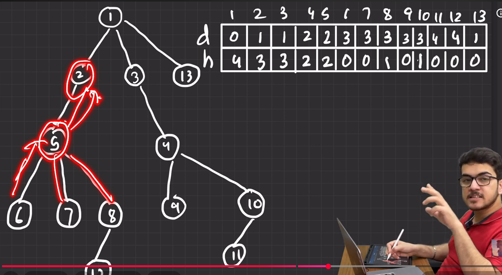

```cpp
#include<bits/stdc++.h>
using namespace std;
const int N = 1e5 + 10;
vector<int> g[N];
int depth[N];
int height[N];

void dfs(int vertex, int par){
	//action on vertex after entering the vertex
	
	for(int child : g[vertex]){
		// action before entering child
		if (child == par) continue;
		depth[child] = depth[vertex] + 1;
		dfs(child, vertex);
		//action after entering child
		height[vertex] = max(height[vertex], height[child] + 1);
	}
	//action before exiting the vertex
}


signed main(){
 ios_base::sync_with_stdio(0);
 cin.tie(0);cout.tie(0);
 int n;
 cin >> n;
 for (int i = 0; i < n-1; ++i) // n-1 edges
 {
 	int v1, v2;
 	cin >> v1 >> v2;
 	g[v1].push_back(v2);
 	g[v2].push_back(v1);
 }
 dfs(1,0);
 for (int i = 1; i <= n; ++i)
 {
 	cout << depth[i] << " " << height[i] << endl;
 }

 return 0;
}

```

### ep 74 precomputation using DFS, questions related to subtrees

these precomputations are also done when going up the tree (during dfs)

let us do this ques. we assume value of vertex is its node only (but if its not a value array will be given)
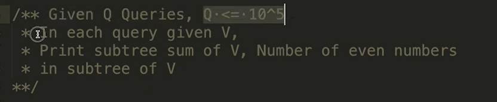

```cpp
#include<bits/stdc++.h>
using namespace std;
const int N = 1e5 + 10;
vector<int> g[N];
int depth[N];
int height[N];
int subtreesum[N];
int evencount[N];

void dfs(int vertex, int par=0){
	//action on vertex after entering the vertex
	subtreesum[vertex] += vertex;
	if (!(vertex&1)){
		evencount[vertex]++;
	}
	// or if value is given use val[vertex];
	for(int child : g[vertex]){
		// action before entering child
		if (child == par) continue;
		
		dfs(child, vertex);
		//action after entering child
		subtreesum[vertex] += subtreesum[child];
		evencount[vertex] += evencount[child];
	}
	//action before exiting the vertex


}


signed main(){
 ios_base::sync_with_stdio(0);
 cin.tie(0);cout.tie(0);
 int n;
 cin >> n;
 for (int i = 0; i < n-1; ++i) // n-1 edges
 {
 	int v1, v2;
 	cin >> v1 >> v2;
 	g[v1].push_back(v2);
 	g[v2].push_back(v1);
 }
 dfs(1);
 for (int i = 1; i <= n; ++i)
 {
 	cout << subtreesum[i] << ' ' << evencount[i] << endl;
 }
 /*
 int q;
 cin >> q;
 while(q--){
 	// cant call dfs() here it total complexity would become Q*N which is TLEs we pre compute subtree sum
 	int V;
 	cin >> V;
 	cout << subtreesum[V] << ' ' << evencount[V] << endl;
 }
 */
 return 0;
}

```

**home work: try this without precomputations**

### ep 75 finding diameter of a tree 

diameter of tree is defined  as maximum number of edges between any 2 vertices them.


there are 2 ways we can compute diameter of a tree, 1 using brute force where we consider single edge root a time and apply dfs on it to compute the max depth. we repeat this for all edges and see which one is max and thats our diameter. this is N * O(N) so N**2

a smart approach is choose any root and find max depth, it is guarenteed that max depth end node is one edge of the diameter. so now we can apply dfs on that only to get our diamater. this is O(N)

```cpp
#include<bits/stdc++.h>
using namespace std;
const int N = 1e5 + 10;
vector<int> g[N];
int depth[N];
int height[N];


void dfs(int vertex, int par=-1){
	//action on vertex after entering the vertex
	
	// or if value is given use val[vertex];
	for(int child : g[vertex]){
		// action before entering child
		if (child == par) continue;

		depth[child] = depth[vertex] + 1;
		dfs(child, vertex);
		//action after entering child
		
	}
	//action before exiting the vertex


}


signed main(){
 ios_base::sync_with_stdio(0);
 cin.tie(0);cout.tie(0);
 int n;
 cin >> n;
 for (int i = 0; i < n-1; ++i) // n-1 edges
 {
 	int v1, v2;
 	cin >> v1 >> v2;
 	g[v1].push_back(v2);
 	g[v2].push_back(v1);
 }
 dfs(1);
 int max_depth = -1;
 int max_dnode;

 for (int i = 1; i <= n; ++i)
 {
 	if (depth[i] > max_depth){
 		max_depth = depth[i];
 		max_dnode = i;
 		
 	}
 	depth[i] = 0; //resetting the depth array as we will use it again from max root
 }
 dfs(max_dnode);
 for (int i = 1; i <= n; ++i)
 {
 	if (depth[i] > max_depth){
 		max_depth = depth[i];
 	}
 }
 cout << max_depth;

 return 0;
}


```

### EP 76 finding LCA of 2 nodes in a tree

it is very simple we first store lowest parent for each node. then use this to construct a parent vector for any node. then simply the highest common index.

```cpp
#include<bits/stdc++.h>
using namespace std;
const int N = 1e5 + 10;
vector<int> g[N];
int depth[N];
int height[N];

int p[N];
void dfs(int vertex, int par=-1){
	//action on vertex after entering the vertex
	p[vertex] = par;
	// or if value is given use val[vertex];
	for(int child : g[vertex]){
		// action before entering child
		if (child == par) continue;

		dfs(child, vertex);
		//action after entering child
		
	}
	//action before exiting the vertex


}
vector<int> path(int v){
	vector<int> ans;
	while(v != -1){
		ans.push_back(v);
		v = p[v];
	}
	reverse(ans.begin(), ans.end());
	return ans;
}


signed main(){
 ios_base::sync_with_stdio(0);
 cin.tie(0);cout.tie(0);
 int n;
 cin >> n;
 for (int i = 0; i < n-1; ++i) // n-1 edges
 {
 	int v1, v2;
 	cin >> v1 >> v2;
 	g[v1].push_back(v2);
 	g[v2].push_back(v1);
 }
 dfs(1);

 int x, y;
 cin >> x >> y;
 vector<int> pathx = path(x);
 vector<int> pathy = path(y);
 int minl = min(pathx.size(), pathy.size());
 int ans = -1;
 for (int i = 0; i < minl; ++i)
 {
 	if (pathx[i] == pathy[i]){
 		ans = pathx[i];
 		
 	}
 	else{
 		break;
 	}
 }
 cout << ans;
 return 0;
}

```

### ep 77 edge deletion question
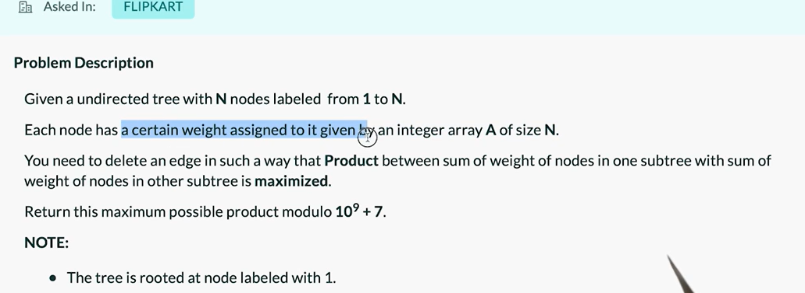
we solve this question using precomputation of sum of each node subtree. then simply go through each (S[root] - S[i]) * (S[i]) to find out max

```cpp
#include<bits/stdc++.h>
using namespace std;
const int N = 1e5 + 10;
vector<int> g[N];
int depth[N];
int height[N];
int sumsubtree[N];
int val[N];
const int M = 1e9 + 7;
void dfs(int vertex, int par=-1){
	//action on vertex after entering the vertex
	sumsubtree[vertex] = val[vertex];
	// or if value is given use val[vertex];
	for(int child : g[vertex]){
		// action before entering child

		if (child == par) continue;

		dfs(child, vertex);
		//action after entering child
		sumsubtree[vertex] += sumsubtree[child];
	}
	//action before exiting the vertex


}


signed main(){
 ios_base::sync_with_stdio(0);
 cin.tie(0);cout.tie(0);
 int n;
 cin >> n;
 for (int i = 0; i < n-1; ++i) // n-1 edges
 {
 	int v1, v2;
 	cin >> v1 >> v2;
 	g[v1].push_back(v2);
 	g[v2].push_back(v1);
 }
 long long max_sum = 0;
 dfs(1);
 for (int i = 2; i < n; ++i)
 {
 	max_sum = max(max_sum, (1LL*(sumsubtree[1] - sumsubtree[i])*(sumsubtree[i])) % M);
 }
 cout << max_sum;


 return 0;
}

```

### ep 78 BFS

this is where u go level by level. shown ex has 1 as level 0. 5,3 as level 1 and 4,2,6 as level 2.
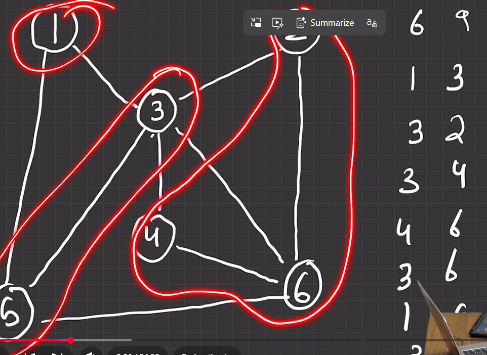

notice how here we need to process the nodes which come first, and we should not proceed down until we have processed all same level nodes. so thought process is we need first come first serve which is basically an queue.

so we maintain a queue and visisted array as shown:
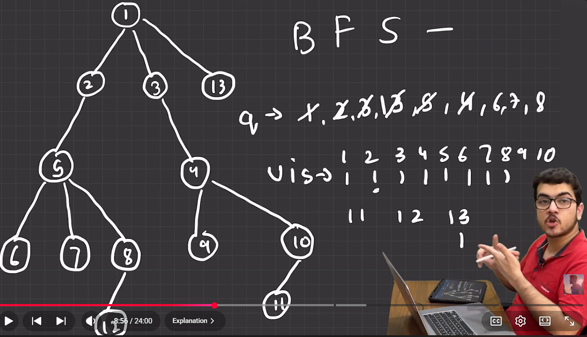

we store same level stuff in queue everytime we reach it and when processing a node, we add its children after the same level stuff. then cross it once we done processing it.

```cpp
#include<bits/stdc++.h>
using namespace std;
const int N = 1e5 + 10;
vector<int> g[N];

int vis[N];
const int M = 1e9 + 7;
int level[N];
void bfs(int source){
	queue<int> q;
	q.push(source);
	vis[source] = 1;

	while(!q.empty()){
		int curr_v = q.front();

		q.pop(); //removing processed node

		for(auto child : g[curr_v]){
			if(!vis[child]){
				q.push(child);
				vis[child] = 1;
				level[child] = level[curr_v] + 1;
			}
		}
	}
}

signed main(){
 ios_base::sync_with_stdio(0);
 cin.tie(0);cout.tie(0);
 int n;
 cin >> n;
 for (int i = 0; i < n-1; ++i) // n-1 edges
 {
 	int v1, v2;
 	cin >> v1 >> v2;
 	g[v1].push_back(v2);
 	g[v2].push_back(v1);
 }
 bfs(1);
 for (int i = 1; i <= n; ++i)
 {
 	cout << i << " : " << level[i] << endl;
 }
 return 0;
}

```

now we see a imp thing about bfs. the level of the vertex gives us shortest path from source vertex to vertex assuming equal weight of edges.

let us now observe time complexity of the bfs code:
the  while loop runs number of node times whereas the for loop runs some 2* no of edges so O (E + V)

### ep 79 shortest path using BFS

https://www.spoj.com/problems/NAKANJ/

we convert this problem into a graph where starting from initial position we mark every single move as an edge. (and so we complete the graph)


**WARNINGS CODE HAS A BUG**
```cpp

#include<bits/stdc++.h>
using namespace std;
const int N = 1e5 + 10;

int vis[8][8];
int lev[8][8];
const int M = 1e9 + 7;
const int INF = 1e9 + 10;


int getX(string s){
	return s[0] - 'a';
}
int getY(string s){
	return s[1] - '1';
}
bool isValid(int x, int y){
	return x >= 0 && y >= 0 && x < 8 && y < 8;  
}
vector<pair<int,int>> movements = {
	{1,2}, {2,1}, {-2, -1}, {-2, 1}, {2, -1}, {-1, -2}, {1, -2}, {-1, 2}

};
void reset(){
	for (int i = 0; i < 8; ++i)
	{
		for (int j = 0; j < 8; ++j)
		{
			lev[i][j] = INF;
			vis[i][j] = INF;
		}
	}
}
int bfs(string source, string dest){
	int sx = getX(source);
	int sy = getY(source);
	int dx = getX(dest);
	int dy = getY(dest);

	queue<pair<int,int>> q; // since in ques, our node is an ordered pair
	q.push({sx, sy});
	vis[sx][sy] = 1;
	lev[sx][sy] = 0;
	while(!q.empty()){
		pair<int,int> p = q.front();

		q.pop();

		for(auto movement : movements){
			int childx = movement.first + p.first;
			int childy = movement.second + p.second;
			if (!isValid(childx, childy)) continue;
			if (vis[childx][childy] == INF){
				q.push({childx, childy});
				lev[childx][childy] = lev[p.first][p.second] + 1;
				vis[childx][childy] = 1;
			}
		}
		if (lev[dx][dy] != INF){
			break;
		}


	}
	return lev[dx][dy];
}

signed main(){
 ios_base::sync_with_stdio(0);
 cin.tie(0);cout.tie(0);
 int n;
 cin >> n;
 while(n--){
 	reset();
 	string s1, s2;
 	cin >> s1 >> s2;
 	cout << bfs(s1, s2) << endl;
 }


 
 return 0;
}
```

### ep 80